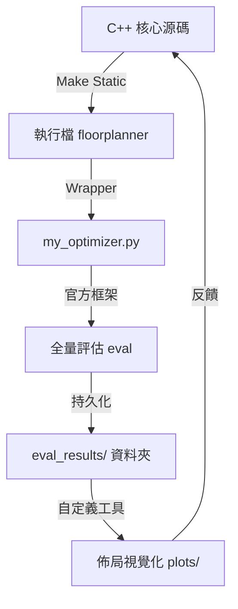

# EDA 自動化開發工作流

這份筆記記錄了 ICCAD 2026 競賽專案中建立的高效率自動化架構。這套架構解決了 C++ 核心與 Python 評估框架之間頻繁同步與數據分析的痛點。

## 1. 核心架構圖

## 2. 關鍵技術點

### 2.1 環境管理 (Conda)
- **環境名稱**：`iccad2026` (Python 3.10+)
- **優勢**：確保官方依賴套件（PyTorch, Shapely, NumPy）與開發環境完全隔離且穩定。

### 2.2 多核心加速策略
- **核心數偵測**：使用 `nproc` 或 `std::thread::hardware_concurrency()`。
- **配置變數**：`FLOORPLANNER_THREADS`。
- **最佳實踐**：在 32 核機器上設定為 30，留 2 核給 OS，可將 SA 探索空間提升 30 倍。

### 2.3 評估持久化 (Persistent Results)
- **痛點**：官方框架預設使用 `/tmp`，跑完即刪。
- **方案**：在 `Makefile` 的 `eval` 目標中加入 `cp -r` 指令，將結果搬移至專案目錄內的 `eval_results/`。
- **變數**：`FLOORPLANNER_KEEP=1`。

### 2.4 自定義視覺化 (Custom Visualization)
- **工具**：`tools/visualize_floorplan.py`。
- **特點**：
    - 白底官方風格。
    - 支援 **Overlap (重疊) 偵測**（標註紅色斜線）。
    - 支援 B2B (Red) 與 P2B (Blue) 連線分析。

### 2.5 效能量化 (Performance Quantification)
- **工具**：`tools/report_score.py`。
- **目標**：根據 ICCAD v9 公式計算加權總分。
- **公式邏輯**：$Total = \frac{\sum (Cost_i \cdot e^{n_i})}{\sum e^{n_i}}$。
- **意義**：提供即時的量化反饋，幫助判斷 SA 參數調整（如溫度下降率）是否真的改善了結果。

## 3. 常用指令快速導覽

| 指令 | 用途 |
|---|---|
| `make static` | 編譯靜態連結執行檔 |
| `make eval-quick` | 抽樣跑 25 筆案例 (省時 75%) |
| `make viz` | 生成佈局圖 |

---
## 關聯節點
- [[EDA/開發環境/WSL2配置]]
- [[ICCAD2026/競賽規則/v9規格]]
